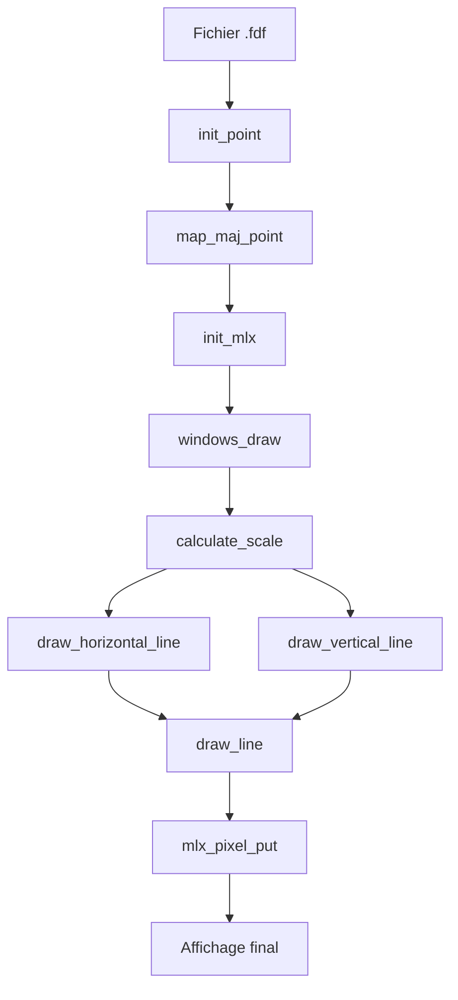

# FDF - Fonctions de Dessin 🎨

Ce document explique le fonctionnement des principales fonctions de dessin du projet FDF (Fil De Fer).

## 📋 Table des matières

- [Architecture générale](#architecture-générale)
- [Projection 3D → 2D](#projection-3d--2d)
- [Algorithme de dessin de lignes](#algorithme-de-dessin-de-lignes)
- [Rendu de la wireframe](#rendu-de-la-wireframe)
- [Gestion de l'affichage](#gestion-de-laffichage)

---

## 🏗️ Architecture générale

Le système de dessin FDF suit cette pipeline :

```
Fichier .fdf → Points 3D → Projection isométrique → Lignes 2D → Affichage MLX
```

### Structures principales

```c
typedef struct s_point {
    float x;      // Coordonnée X (après projection)
    float y;      // Coordonnée Y (après projection)  
    float alt;    // Altitude originale (Z)
} t_point;

typedef struct s_app {
    t_map   *map;     // Données de la carte
    void    *mlx;     // Contexte MLX
    void    *win;     // Fenêtre MLX
    int     x_size;   // Largeur de la fenêtre
    int     y_size;   // Hauteur de la fenêtre
} t_app;
```

---

## 🔄 Projection 3D → 2D

### Fonction : `map_maj_point()` 
**Fichier :** `src/define.c`

Transforme les coordonnées 3D en coordonnées 2D avec projection isométrique.

#### Algorithme :

```c
// Pour chaque point (i,j) de la grille :
x_3d = j;           // Colonne → X
y_3d = i;           // Ligne → Y  
z_3d = altitude;    // Hauteur du point

// Projection isométrique (angle de 30°) :
x_2d = (x_3d - y_3d) * cos(angle)
y_2d = (x_3d + y_3d) * sin(angle) - z_3d
```

#### Fonctions utilitaires :

- **`deg_to_rad(float degrees)`** : Convertit les degrés en radians
- **`apply_isometric_projection(...)`** : Applique la projection sur un point

#### Résultat :
- ✅ Effet 3D réaliste
- ✅ Perspective isométrique standard
- ✅ Gestion de l'altitude (relief)

---

## 📏 Algorithme de dessin de lignes

### Fonction : `draw_line()`
**Fichier :** `src/draw_line.c`

Utilise l'**algorithme de Bresenham** pour dessiner des lignes pixellisées parfaites.

#### Principe :

L'algorithme choisit automatiquement la méthode selon la pente :

```c
if (|Δy| < |Δx|)  →  draw_line_low()   // Pente faible
else              →  draw_line_high()  // Pente forte
```

#### `draw_line_low()` - Lignes horizontales :
```c
dx = p2.x - p1.x
dy = p2.y - p1.y
d = 2*dy - dx       // Variable de décision

for x from p1.x to p2.x:
    plot_pixel(x, y)
    if d > 0:
        y += 1
        d -= 2*dx
    d += 2*dy
```

#### `draw_line_high()` - Lignes verticales :
```c
// Même principe mais en échangeant X et Y
```

#### Avantages :
- ✅ **Pas d'anticrénelage** : Lignes nettes
- ✅ **Optimisé** : Seulement des additions/soustractions
- ✅ **Toutes les pentes** : Gère tous les angles
- ✅ **Symétrique** : Même résultat dans les deux sens

---

## 🖼️ Rendu de la wireframe

### Fonction : `windows_draw()`
**Fichier :** `src/windows.c`

Orchestre le dessin complet de la grille 3D.

#### Pipeline :

1. **Calcul de l'échelle** (`calculate_scale()`)
2. **Dessin des lignes horizontales** (`draw_horizontal_line()`)
3. **Dessin des lignes verticales** (`draw_vertical_line()`)

#### Calcul de l'échelle automatique :

```c
scale = (largeur_fenêtre * 50%) / largeur_carte
scale = max(5, min(50, scale))  // Limites de sécurité
```

#### Centrage automatique :

```c
offset_x = centre_fenêtre - (largeur_carte * scale) / 2
offset_y = centre_fenêtre - (hauteur_carte * scale) / 2
```

#### Connexions de la grille :

```c
// Pour chaque point (i,j) :
if (j < width-1)  →  ligne vers (i, j+1)    // Horizontale →
if (i < height-1) →  ligne vers (i+1, j)    // Verticale ↓
```

#### Fonctions utilitaires :

- **`calculate_scale()`** : Calcule l'échelle d'affichage optimale
- **`draw_horizontal_line()`** : Dessine une ligne horizontale entre deux points adjacents
- **`draw_vertical_line()`** : Dessine une ligne verticale entre deux points adjacents

---

## 🖥️ Gestion de l'affichage

### Initialisation MLX : `init_mlx()`
**Fichier :** `src/fdf.c`

Configure la fenêtre d'affichage :

```c
1. Initialisation MLX
2. Récupération taille écran
3. Calcul des dimensions (70% de l'écran)
4. Création de la fenêtre
5. Configuration des événements
```

### Boucle principale : `main()`

```c
1. Vérification des arguments
2. Lecture et parsing du fichier .fdf
3. Application de la projection isométrique
4. Initialisation de l'affichage MLX
5. Rendu de la wireframe
6. Gestion des événements (fermeture)
7. Boucle d'affichage MLX
```

---

## 🎯 Flux d'exécution complet



---

## 📊 Performances

### Complexité algorithmique :
- **Projection** : O(n×m) où n,m = dimensions de la carte
- **Dessin lignes** : O(k) où k = nombre total de pixels
- **Affichage** : O(n×m) pour parcourir tous les points

### Optimisations appliquées :
- ✅ **Bresenham** : Pas de calculs flottants pour les lignes
- ✅ **Échelle adaptative** : Évite les débordements
- ✅ **Centrage automatique** : Calculs une seule fois
- ✅ **Fonctions courtes** : Optimisation du compilateur

---

## 🔧 Configuration

### Paramètres modifiables :

```c
// Dans fdf.c
map->angle = 30;           // Angle de projection (degrés)

// Dans windows.c  
scale_factor = 50%;        // % de l'écran utilisé
min_scale = 5;            // Échelle minimum
max_scale = 50;           // Échelle maximum

// Dans draw_line.c
color = 0xFFFFFF;         // Couleur des lignes (blanc)
```

---

## ✨ Fonctionnalités

- 🎨 **Projection isométrique réaliste**
- 📏 **Échelle adaptative automatique**  
- 🎯 **Centrage automatique dans la fenêtre**
- 🖼️ **Rendu wireframe complet**
- ⚡ **Algorithme de Bresenham optimisé**
- 🧹 **Code conforme à la norme 42**
- 🔧 **Paramètres configurables**

---

*Documentation générée pour FDF - École 42*
